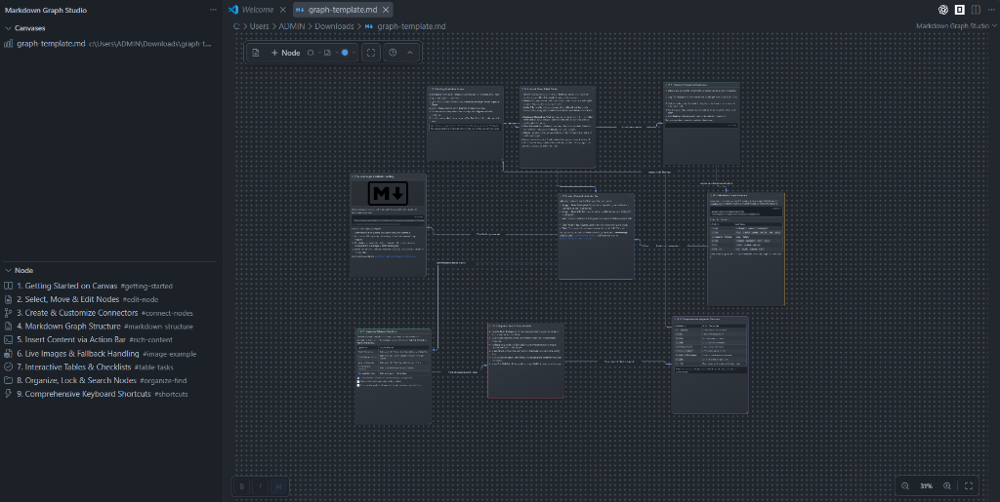

# Markdown Graph Studio

Visual node-graph editor and interactive diagram workspace for Markdown documents, directly inside VS Code.

[](https://code.visualstudio.com/)
[](https://marketplace.visualstudio.com/items?itemName=TinhSsc.md-graph-studio)
[](https://open-vsx.org/extension/TinhSsc/md-graph-studio)
[](https://ko-fi.com/toancao)
[](LICENSE)
[](#)

<p align="center">
  
</p>

---

## Interactive Walkthrough Demo

<p align="center">
  
</p>

---

## Overview

**Markdown Graph Studio** turns standard Markdown files into visual, interactive node-and-edge diagrams while keeping plain Markdown as the strict, single source of truth.

- **Zero Vendor Lock-in**: Nodes are level-2 headings (`##`), connections are standard wikilinks (`[[target]]`), and content uses standard GitHub Flavored Markdown (GFM).
- **Clean Markdown (Sidecar Storage)**: Layout coordinates, zoom levels, and viewport settings can be stored in an external `.md.graph.json` sidecar file, keeping your Markdown text completely free of diagram noise.
- **Native VS Code Integration**: Runs as a Custom Editor with dedicated Activity Bar views (`Canvases` and `Node` search outline), side-by-side editing, and instant two-way synchronization.
- **Self-Contained & Private**: Operates entirely within your local workspace. No external servers, no cloud telemetry, and no browser dependencies.

---

## Markdown Syntax & Data Model

Every second-level heading (`##`) defines a graph node. Wiki-style bullet items define directional connections.

```markdown
## Authentication Service {#auth-service}
<!-- graph-node: shape=rounded-rectangle; color=blue; icon=shield -->
Handles JWT token validation and OAuth2 session tokens.

- [[database-service|Read/Write Session]] <!-- graph-edge: arrow=forward; line=solid; path=orthogonal -->
- [[audit-log|Security Events]] <!-- graph-edge: arrow=forward; line=dashed; path=orthogonal -->

## Database Service {#database-service}
<!-- graph-node: shape=rectangle; color=green; icon=database -->
PostgreSQL cluster storing persistent tenant records.

## Audit Log {#audit-log}
<!-- graph-node: shape=rounded-rectangle; color=gray; icon=file-text -->
Append-only log for compliance tracking.
```

### Supported Node & Edge Attributes

| Attribute | Scope | Supported Values |
| :--- | :--- | :--- |
| `shape` | Node | `rectangle`, `rounded-rectangle` |
| `color` | Node / Edge | `blue`, `green`, `yellow`, `red`, `purple`, `gray` |
| `icon` | Node | 27 built-in icons (e.g. `server`, `database`, `shield`, `book`, `terminal`, `zap`, `lock`, `cloud`) |
| `collapsed` | Node | `true`, `false` |
| `locked` | Node | `true`, `false` |
| `line` | Edge | `solid`, `dashed`, `dotted` |
| `arrow` | Edge | `forward`, `backward`, `both`, `none` |
| `from` / `to` | Edge | `top`, `right`, `bottom`, `left` |

> [!TIP]
> Explicit heading IDs (`{#node-id}`) are recommended. They ensure connectors and saved layout coordinates remain stable even if you rename the node title.

---

## Key Features

### 1. Interactive GFM Tables
- Click directly into table cells to edit inline.
- Navigate across cells in 4 directions using arrow keys (<kbd>↑</kbd> <kbd>↓</kbd> <kbd>←</kbd> <kbd>→</kbd>) or <kbd>Tab</kbd> / <kbd>Shift+Tab</kbd>.
- Context menu support: Insert/delete rows and columns, set column text alignment (left, center, right), and span across columns.

### 2. Rich Content Blocks & Action Bar
- Floating action bar for fast insertion: Images (workspace file or external URL), Links, Checklist Tasks, Code blocks, Tags, Quotes, and Tables.
- Full markdown rendering on canvas: inline formatting (`**bold**`, `*italic*`, `~~strike~~`, `` `code` ``), autolinks, blockquotes, and fenced code blocks.
- Interactive task items: toggle checkbox directly on canvas with automatic Markdown state synchronization.

### 3. Smart Orthogonal Connector Routing
- Automatic orthogonal edge routing with collision avoidance and border contact snapping.
- Custom connection ports (`top`, `right`, `bottom`, `left`) for precise diagram architecture.
- Draggable route bend handles and customizable line styles (`solid`, `dashed`, `dotted`), colors, and midpoint label pills.

### 4. Activity Bar & Search Explorer
- **Canvases View**: Displays recently accessed Markdown graphs in the active workspace with one-click opening.
- **Node Outline View**: Tree structure of all nodes in the active graph with a live search filter (<kbd>Ctrl+F</kbd>) to instantly center and select any node on canvas.

### 5. Flexible Storage Strategies
- **Sidecar Mode (`sidecar`)** *(Default)*: Stores visual coordinates and viewport state in a sibling `.md.graph.json` file. Your `.md` file contains only pure Markdown.
- **Embedded Mode (`embedded`)**: Appends an unobtrusive `<!-- canvas-meta: ... -->` comment at the end of your Markdown file.
- **Stateless Mode (`stateless`)**: Computes layout dynamically without writing metadata files to disk.

---

## Configuration Settings

Configure extension behavior via VS Code Settings (<kbd>Ctrl+,</kbd> or <kbd>Cmd+,</kbd>):

| Setting | Type | Default | Description |
| :--- | :--- | :--- | :--- |
| `markdownGraphStudio.storageMode` | `string` | `"sidecar"` | Layout metadata storage strategy: `sidecar` (`.md.graph.json`), `embedded` (in-file comment), or `stateless`. |
| `markdownGraphStudio.sidecarNaming` | `string` | `"dot-md-graph-json"` | Sidecar file naming convention: `foo.md.graph.json` or `foo.graph.json`. |

---

## Command Palette Actions

All commands are accessible via <kbd>Ctrl+Shift+P</kbd> / <kbd>Cmd+Shift+P</kbd>:

| Command | Title | Shortcut | Description |
| :--- | :--- | :--- | :--- |
| `markdownGraphStudio.openAsGraph` | Open as Graph | <kbd>Ctrl+Alt+G</kbd> | Opens selected/active Markdown file in visual graph studio. Available in Explorer context & Editor title. |
| `markdownGraphStudio.openSideBySide` | Open Text and Graph Side by Side | <kbd>Ctrl+Alt+Shift+G</kbd> | Opens Markdown text and visual graph canvas side-by-side. |
| `markdownGraphStudio.pickCanvas` | Open Canvas | — | Quick-pick selection of Markdown graphs in the workspace. |
| `markdownGraphStudio.refreshCanvases` | Refresh Canvases | — | Refreshes the workspace graph list in the Activity Bar. |
| `markdownGraphStudio.convertToSidecar` | Convert to Sidecar Storage | — | Migrates embedded metadata to external `.md.graph.json`. |
| `markdownGraphStudio.embedMetadata` | Embed Metadata into Markdown | — | Inlines sidecar metadata into a `<!-- canvas-meta -->` comment. |
| `markdownGraphStudio.searchNodes` | Search Nodes | <kbd>Ctrl+F</kbd> | Focuses the node search input in the Activity Bar. |
| `markdownGraphStudio.clearNodeFilter` | Clear Filter | — | Clears the active node filter in the Activity Bar. |
| `markdownGraphStudio.closeOutline` | Close Node Outline | — | Clears the outline view in the Activity Bar. |

---

## Keyboard Shortcuts & Canvas Controls

### Canvas & Viewport

| Action | Shortcut / Gesture |
| :--- | :--- |
| **Pan Canvas** | Middle Mouse Drag or <kbd>Space</kbd> + Left Click Drag |
| **Zoom In / Out** | Mouse Wheel or <kbd>Ctrl</kbd> + <kbd>+</kbd> / <kbd>-</kbd> |
| **Fit Graph to View** | <kbd>F</kbd> or <kbd>Ctrl+0</kbd> |
| **Reset Zoom (100%)** | <kbd>Ctrl+1</kbd> |
| **Deselect All** | <kbd>Escape</kbd> |

### Nodes & Selection

| Action | Shortcut / Gesture |
| :--- | :--- |
| **Create New Node** | <kbd>N</kbd> or <kbd>Insert</kbd> |
| **Select All Nodes** | <kbd>Ctrl+A</kbd> |
| **Multi-select** | <kbd>Shift</kbd> + Left Click or Marquee Drag on Canvas |
| **Move Selection** | Left Click Drag selected node(s) |
| **Duplicate Node(s)** | <kbd>Ctrl+D</kbd> |
| **Inline Edit Node** | <kbd>Enter</kbd> (or Double Click) |
| **Delete Selection** | <kbd>Delete</kbd> or <kbd>Backspace</kbd> |
| **Copy / Cut / Paste** | <kbd>Ctrl+C</kbd> / <kbd>Ctrl+X</kbd> / <kbd>Ctrl+V</kbd> (syncs Markdown with OS clipboard) |
| **Undo / Redo** | <kbd>Ctrl+Z</kbd> / <kbd>Ctrl+Y</kbd> |
| **Connect Nodes** | Drag from white border port to target node |
| **Resize Node** | Drag bottom-right corner grip |

### Inline Editor & Table Navigation

| Action | Shortcut / Gesture |
| :--- | :--- |
| **Navigate Cells / Tasks** | Arrow keys (<kbd>↑</kbd> <kbd>↓</kbd> <kbd>←</kbd> <kbd>→</kbd>) at boundary |
| **Next / Previous Cell** | <kbd>Tab</kbd> / <kbd>Shift+Tab</kbd> |
| **Save & Finish Edit** | <kbd>Enter</kbd> (use <kbd>Ctrl+Enter</kbd> in multiline code) |
| **Discard Changes** | <kbd>Escape</kbd> |
| **Shortcuts Modal** | <kbd>?</kbd> or <kbd>F1</kbd> |

---

## Support the Project

If you find **Markdown Graph Studio** helpful, consider supporting its creator via Ko-fi:

[](https://ko-fi.com/toancao)

Or donate directly at: [ko-fi.com/toancao](https://ko-fi.com/toancao)

---

## Development & Testing

### Prerequisites
- [Node.js](https://nodejs.org/) (v20 or higher recommended)
- [VS Code](https://code.visualstudio.com/) (v1.95.0 or higher)

### Build & Verification Commands

```bash
# Install dependencies
npm install

# Type check
npm run check

# Run automated tests
npm test

# Verify all checks (type check + tests + esbuild bundle)
npm run verify

# Package extension into .vsix file
npm run package
```

The package command produces `dist/markdown-graph-studio.vsix`. You can test it locally in VS Code via **Extensions: Install from VSIX...**
